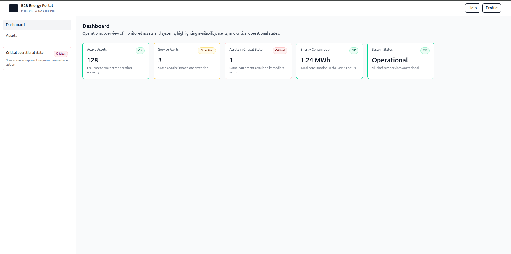
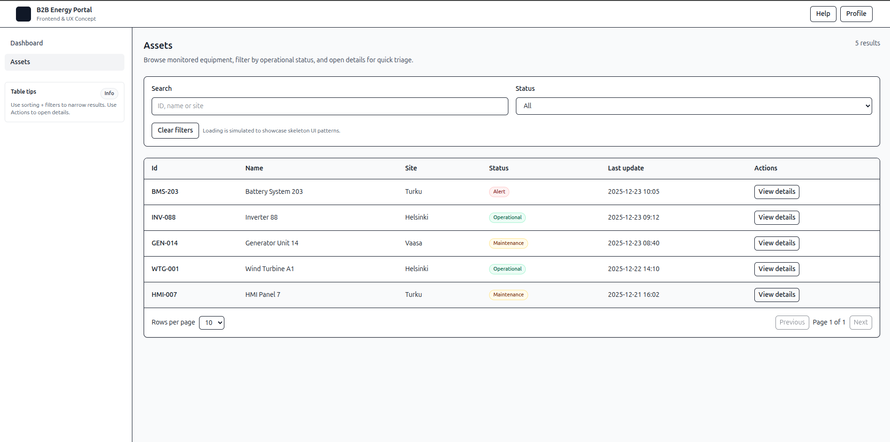

# B2B Energy Portal — Frontend & UX Concept

A frontend and UX concept for a B2B energy operations portal, focused on clarity, accessibility, and operational awareness.

This project was intentionally designed as a **fast, realistic concept** aligned with how large industrial and energy companies structure internal and customer-facing platforms. The goal is not visual excess, but **clear communication of system state, asset health, and operational priorities**.

---

## ✨ Concept Overview

The portal simulates a simplified operational environment where users can:

- Quickly understand the **current operational state** of assets and systems
- Identify **alerts and critical conditions**
- Navigate and explore assets using **search, filters, sorting, and pagination**
- Interact with a UI designed for **keyboard-first navigation and accessibility**

The project emphasizes:
- Information hierarchy
- Calm but meaningful visual feedback
- Subtle motion that supports understanding (never distracts)
- UI patterns commonly found in enterprise and industrial systems

---

## 🧭 Main Features

### Dashboard
- High-level operational overview
- Status-driven metric cards with semantic color usage
- Clear distinction between *OK*, *Attention*, and *Critical* states
- Microinteractions to reinforce hierarchy and affordance

### Assets
- Data table with:
  - Search
  - Status filtering
  - Sorting
  - Pagination
- Skeleton loading states
- Row-level actions with modal details
- Fully keyboard accessible

### Sidebar & Navigation
- Responsive layout (desktop + mobile drawer)
- Route-aware contextual callouts
- Keyboard and focus management (a11y-first)
- Minimal cognitive load

---

## ♿ Accessibility Considerations

Accessibility was treated as a **first-class concern**, not an afterthought:

- Semantic HTML structure
- Keyboard-first navigation
- Focus management for modals and drawers
- ARIA attributes where appropriate
- Status communicated via **text + color** (not color alone)
- `aria-live` regions for dynamic content

---

## 🧩 Tech Stack

- **React** (with Hooks)
- **TypeScript**
- **Vite**
- **Tailwind CSS**
- **React Router**
- ESLint + TypeScript strict mode

The project is structured to be **API-ready**, even though data is currently mocked.

---

## 📁 Project Structure

```
src/
├─ assets/                # Screenshots and static assets
├─ components/
│  └─ layout/             # AppShell, Sidebar, Header, Drawer, Callouts
├─ data/                  # Mocked metrics and future data sources
├─ pages/
│  ├─ Dashboard.tsx
│  └─ Assets.tsx
├─ App.tsx
├─ AppLayout.tsx
├─ index.css
└─ main.tsx
```

---

## 🖥 Screenshots

### Dashboard


### Assets


---

## 🚀 Getting Started

### Prerequisites
- Node.js 18+
- npm

### Clone the repository
```bash
git clone https://github.com/your-username/b2b-energy-portal.git
cd b2b-energy-portal
```

### Install dependencies
```bash
npm install
```

### Run locally
```bash
npm run dev
```

The application will be available at:
```
http://localhost:5173
```

---

## 🔍 Design & UX Rationale

This project intentionally avoids over-stylization.

Design decisions were guided by:
- Real-world enterprise dashboards
- Industrial UX patterns
- The need for **trust, clarity, and speed**
- Interfaces where mistakes are costly and clarity matters

Subtle animations, restrained color usage, and semantic layouts help users **understand system state at a glance**.

---

## 🧠 Notes

- All data is mocked for demonstration purposes
- No backend integration (by design)
- Focus is on frontend architecture, UX reasoning, and interaction quality

---

## 📌 Future Improvements

- API integration
- Role-based access
- Persistent filters
- Export actions
- Real-time updates
- Dark mode (accessibility-driven)

---

## 👤 Author

**Lincoln Araújo**  
Frontend Developer & UX Engineer  

---

> This project was created as a deliberate exploration of enterprise frontend patterns, accessibility-first design, and operational UX — not as a production-ready system, but as a realistic and thoughtful concept.
